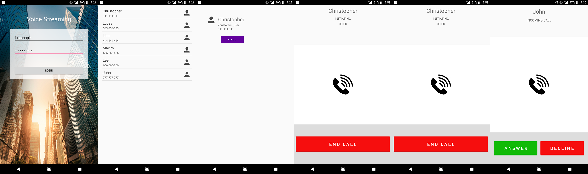

# Voice-Streaming
Application created to send and receive voice over internet connection.
To achive voice streaming via internet, application is using Sinch API.

Sinch website: https://www.sinch.com
Some basic tutorial: https://www.sinch.com/tutorials/android-app-to-app-voip-tutorial

# Screenshots

